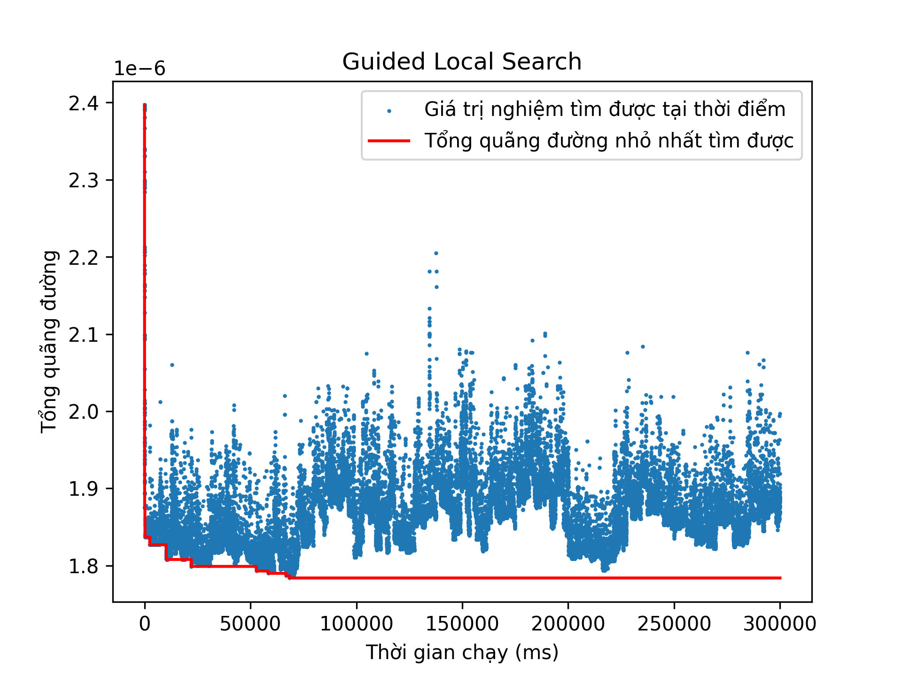

# Báo cáo tiến độ 2

Trong 1 tuần qua em đã mô hình được 3 bài toán
CVRP, VRPTW và PDPTW sử dụng `RoutingModel`
của OR-Tools, và đánh giá sơ bộ khả năng giải
quyết bài toán của OR-Tools. Ngoài ra, em cũng
có suy nghĩ về việc mô hình các bài toán khác
với OR-Tools, hiện em đang suy nghĩ về việc
mô hình bài toán vận chuyển của track Tiki,
SOICT Hackathon 2024, tuy còn một số khúc mắc
nhỏ nhưng em nghĩ có thể thực hiện được.

Thời gian tới em sẽ suy nghĩ kỹ hơn về mô hình
bài toán Tiki, cũng như đưa ra báo cáo chi tiết
về khả năng của OR-Tools trong việc giải CVRP,
VRPTW và PDPTW.

## Mô hình CVRP, VRPTW và PDPTW

Mã nguồn hầu như giống mẫu
trong documentation. Có một số
điểm đáng khác biệt nhỏ:

- Bài toán VRPTW và PDPTW sử dụng khoảng cách
số thực trong khi các giá trị trong OR-Tools
là kiểu nguyên 64bit, do vậy, em scale mảng
khoảng cách và mảng time windows lên 1e9 lần.

- Bài toán VRPTW vs PDPTW có thêm thời gian
phục vụ (service_time) tại mỗi khách
nên em sử dụng `distance_callback`
va `travel_time_callback` riêng biệt. Trong đó,
`travel_time_callback` có thêm thời gian phục vụ

```c++
int traval_time_callback_index = model.RegisterTransitCallback([&problem, &manager, distance_scaling_factor](int64_t from_index, int64_t to_index) -> int64_t {
    int64_t from_customer = manager.IndexToNode(from_index).value();
    int64_t to_customer = manager.IndexToNode(to_index).value();
    return (problem.service_time(from_customer) + problem.distance(from_customer, to_customer))*distance_scaling_factor;
});
```

- Bài toán VRPTW (SINTEF) và PDPTW có mục tiêu
tối thiểu hóa số phương tiện sử dụng, và mục
tiêu này quan trọng hơn tối thiểu hóa quãng
đường. Điều này được đưa vào mô hình bằng
cách đánh phạt trên mỗi phương tiện sử dụng
một lượng lớn (1e16).

```c++
model.SetFixedCostOfAllVehicles(1e16);
```

## Đánh giá sơ bộ cho bài toán CVRP

Bộ giải Routing của OR-Tools có cho lựa chọn
5 thuật toán dựa trên Local Search:

- GREEDY_DESCENT
- GUIDED_LOCAL_SEARCH
- SIMULATED_ANNEALING
- TABU_SEARCH
- GENERIC_TABU_SEARCH

Trong đó, thuật toán GREEDY_DESCENT dừng ngay
khi tới cực trị địa phương. Các thuật toán còn
lại sử dụng các cơ chế khám phá bổ sung sau khi
đạt cực trị địa phương và phải đặt điều kiện
dừng (vd: giới hạn thời gian).

Trước hết, em thử nghiệm các thuật toán này
trên cùng một instance để quan sát chất lượng của
các thuật toán.

Trong bộ dữ liệu "Set A (Augerat, 1995)"
kinh điển cho CVRP, em chạy toàn bộ thuật toán
của OR-Tools trên bộ dữ liệu "A-n80-k10" với
80 khách hàng.
Các thuật toán được giới hạn thời gian 5 phút
(300,000 ms)

### Greedy Descent

Thu được nghiệm với hàm mục tiêu 1875 sau 74ms.

### Guided Local Search



### Simulated Annealing


### Tabu Search


### Generic Tabu Search


### Toàn bộ phương pháp

Biểu đồ dưới đây cho thấy chất lượng nghiệm
tốt nhất từng tìm được theo thời gian của
mỗi thuật toán.


Dưới đây là bảng chất lượng nghiệm của các
phương pháp

| Instance: A-n80-k10 | Tổng quãng đường | Thời điểm tìm được |
|---------------------|------------------|--------------------|
| Greedy Descent      | 1875 (6.35%)     | 74 ms              |
| Guided Local Search | 1784 (1.19%)     | 68447 ms           |
| Simulated Annealing | 1875             |                    |
| Tabu Search         | 1791 (1.59%)     | 155615 ms          |
| Generic Tabu Search | 1875             |                    |
| Optimal             | 1763             |                    |

### Kết luận sơ bộ

Có thể thấy rằng 2 thuật toán Simulated Annealing
và Generic Tabu Search không thể cải thiện được
nghiệm so với cực trị địa phương tìm được.
Từ biểu đồ nghiệm của SA, thuật toán đã hội tụ
từ rất sớm và chẳng thể tìm được nghiệm tốt hơn,
cũng không thể thoát được cực trị địa phương.
Với Generic Tabu Search, thuật toán lại đi khám
phá các nghiệm tệ hơn nghiệm tìm được rất nhiều.

Thuật toán Guided Local Search và Tabu Search
là 2 thuật toán có triển vọng hơn. Trong đó,
có vẻ GLS cho nhiệm tốt hơn và tìm được nghiệm
đó sớm hơn TS. Song, với chỉ một instance thì
cũng chauw thể đưa ra kết luận tổng quan.
Nhưng trên documentation của OR-Tools cũng chỉ
ra rằng, [nhìn chung, Guided Local Search là thuật toán
hiệu quả nhất cho các bài định tuyến](https://developers.google.com/optimization/routing/routing_options#local_search_options)

Về chất lượng nghiệm, thuật toán GLS cho kết
quả chỉ tệ hơn nghiệm tối ưu 1.19%, là một kết
quả tốt, song, để tìm được nghiệm mất 68s.
Nếu quan sát chi tiết hơn, tại mốc 22s, GLS đã tìm được nghiệm với tổng quãng đường
1799, tệ hơn 2.04% nghiệm tối ưu. Tại mốc
10s, GLS tìm được nghiệm với tổng quãng đường
1808, tệ hơn 2.55% nghiệm tối ưu.

Instance chạy thuật toán này vẫn là instance nhỏ,
chỉ có 80 khách hàng. Thời gian tới em sẽ
chạy trên nhiều bộ dữ liệu lớn hơn để đưa ra
được kết luận tổng quan hơn.
