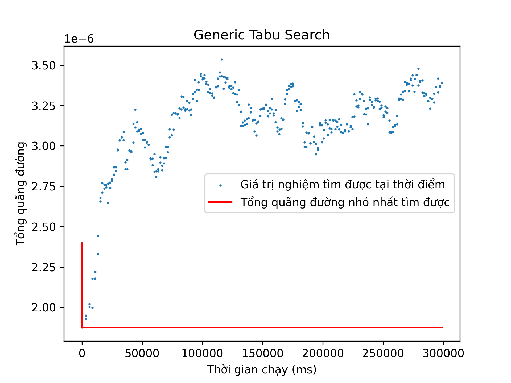

# Báo cáo tổng hợp hoàn thành công việc

**Tên công việc**: Tìm hiểu và đánh giá các thuật toán VRP trong OR-Tools

**Nội dung công việc**:

- Hiểu các bài toán (biến thể của VRP) có trong OR-Tools
- Hiểu các source code cho mỗi bài toán (cách mô hình toán ràng buộc, hàm mục tiêu)
- Tìm download hoặc tại mới data test để làm thí nghiệm
- Chạy thí nghiệm các source code OR-Tools cho mỗi bài toán trên tập data tìm/tạo được
- Viết report phân tích, đánh giá

**Mục lục**:

1. Tóm lược về OR-Tools và việc sử dụng OR-Tools giải bài toán định tuyến
2. Mô tả các biến thể được chọn để đánh giá
    1. CVRP
    2. VRPTW
    3. PDPTW
    4. Bài toán TIKI - SOICT Hackathon 2024
3. Kết quả phân tích và đánh giá
    1. Các bộ dữ liệu sử dụng
    2. So sánh giữa các thuật toán của OR-Tools với nhau
    3. So sánh kết quả của OR-Tools với các kết quả nghiên cứu tốt nhất

## 1. Tóm lược về OR-Tools và việc sử dụng OR-Tools giải bài toán định tuyến

### 1.1. Tóm lược về OR-Tools

OR-Tools là bộ công cụ mã nguồn mở dùng để giải các bài toán tối ưu rời rạc,
ví dụ như:

- Bài toán định tuyến: Tìm đường đi tối ưu cho một loạt các phương tiện phục
  vụ các khách hàng, kết hợp với các ràng buộc như ràng buộc trọng tải, thời gian,
  và nhiều loại ràng buộc phức tạp khác.
- Bài toán lập lịch: Tìm một lịch trình tối ưu nhất cho một chuỗi công việc phức
  tạp, trong đó, công việc này có thể bắt buộc làm trước công việc kia, mỗi công việc
  yêu cầu máy móc và các tài nguyên khác.
- Bài toán xếp đồ vật: Xếp nhiều nhất có thể các đồ vật có kích thước khác nhau
  vào một số thùng chứa, trong đó có giới hạn về trọng tải.

Các bài toán này đều có không gian lời giải rất lớn, khó có thể duyệt hết được.
Do vậy, OR-Tools tận dụng nhiều kỹ thuật tiên tiến để thu gọn không gian tìm kiếm,
từ đó, tìm ra một lời giải tối ưu hoặc gần tối ưu.

### 2. Giải bài toán định tuyến với OR-Tools

OR-Tools cung cấp bộ giải định tuyến chứa các
công cụ để mô hình và giải các bài toán định tuyến phức tạp.

Để giải một bài toán định tuyến sử dụng OR-Tools, chúng ta cần
mô hình hóa bài toán vào lớp `RoutingModel`. Sau đó, có thể gọi hàm
giải (`RoutingModel::Solve`) cùng với các tham số như cách khởi tạo
nghiệm, hay thuật toán sử dụng để thu được nghiệm.

Để đưa ràng buộc vào `RoutingModel`, có 2 công cụ cần chú ý đến là
`RoutingDimension` và `Solver`.

`RoutingDimension` là một kiểu đối tượng trong OR-Tools biểu diễn các
biến quyết định có tính cộng dồn trên mỗi lộ trình. Ví dụ như lượng
hàng xe mang tại mỗi khách hàng hay thời điểm xe tới một khách nào đó
là biến quyết định mang tính cộng dồn. Mỗi `RoutingDimension` đại diện
cho một thuộc tính cộng dồn và chứa toàn bộ biến cộng dồn tại toàn bộ
các khách. Các biến cộng dồn $cumuls$ này mang sẵn một ràng buộc:
Nếu $i \rightarrow j$ là một cạnh trong lộ trình thì:
$cumuls(j) = cumuls(i) + transits(i, j) + slacks(i) + state\_dependent\_transits(i)$.

Việc thêm ràng buộc cho `RoutingModel` có thể thực hiện bằng cách đặt
giá trị tối đa cho các biến trong `RoutingDimension` khi khởi tạo.
Ví dụ với _dimension là lượng hàng thì đặt trọng tải làm giá trị tối
đa sẽ đảm bảo không có lộ trình nào vượt trọng tải.

`Solver` là bộ giải của một `RoutingModel` và có thể được truy xuất
với hàm `RoutingModel::solver`. Bộ giải này cung cấp hàm `Solver::AddConstraint`
để thêm ràng buộc cho bộ giải. Các ràng buộc này được đặt lên các biến
quyết định có trong `RoutingModel`, ví dụ như các biến cộng dồn từ `RoutingDimension`.
Có rất nhiều kiểu ràng buộc, ví dụ như `Solver::MakeEquality` để ép 2 biến
quyết định bằng nhau, hay `Solver::MakeLessOrEqual`để ép biến này nhỏ bằng
biến kia.

Ví dụ như 2 ràng buộc dưới đây dùng để ép khách hàng gắn với `pickup_index`
và `delivery_index` xuất hiện cùng lộ trình và `pickup_index` xuất hiện
trước `delivery_index`

```c++
    solver->AddConstraint(
solver->MakeEquality(
routing.VehicleVar(pickup_index),
routing.VehicleVar(delivery_index)
)
);

solver->AddConstraint(
solver->MakeLessOrEqual(
distance_dimension->CumulVar(pickup_index),
distance_dimension->CumulVar(delivery_index)
)
);
```

Đối với hàm mục tiêu, mặc định hàm mục tiêu trong `RoutingModel` luôn
chứa tổng chi phí trên cách cạnh trong lộ trình. Chi phí mỗi cạnh
có thể được người dùng thiết lập qua `RoutingModel::SetArcCost...`.
Ngoài ra, có thể cộng thêm vào hàm mục tiêu các chi phí khác. Ví
dụ như thêm vào hàm mục tiêu chi phí sử dụng phương tiện (để đánh phạt số
phương tiện được dùng), hay chi phí phạt trên mỗi khách không được thăm
nếu bài toán cho phép không thăm toàn bộ khách.

Khoảng giá trị của một _dimension cũng có thể được thêm vào hàm mục
tiêu với một trọng số. Ví dụ với _dimension là quãng đường xe chạy,
(giá trị lớn nhất - giá trị nhỏ nhất) của _dimension này là độ dài
lộ trình lớn nhất. Ta có thể thêm một lượng tỉ lệ thuận với giá trị
này để giảm độ dài lộ trình dài nhất như sau:

```c++
routing_model.GetMutableDimension("Distance")->SetGlobalSpanCostCoefficient(100);
```

trong đó, "Distance" là một _dimension được thêm vào `RoutingModel`, được thiết
lập để cộng dồn quãng đường xe chạy và đặt tên là "Distance".

## 2. Các biến thể được đánh giá trong báo cáo và cách mô hình bài toán với OR-Tools

Với sự linh hoạt của OR-Tools, công cụ này có thể giải rất nhiều
bài toán. Trong báo cáo này, em thực hiện thử nghiệm sử dụng
OR-Tools để giải 4 bài toán sau:

- CVRP
- VRPTW
- PDPTW
- Bài toán Tiki - SOICT Hackathon 2024

### 2.1. CVRP

Trong bài toán định tuyến này, một loạt các phương tiện xuất phát từ 1 kho chung,
đi giao/lấy hàng tại các khách hàng rồi trở về kho chung. Mỗi khách hàng được
phục vụ một lần duy nhất, và mỗi xe có giới hạn về lượng hàng xe mang tại mỗi
thời điểm. Mục tiêu tối ưu là tổng quãng đường di chuyển của các xe. Đây là một
bài toán định tuyến kinh điển, được nghiên cứu phổ biến.

Bài toán này được giải mẫu trong documentation của OR-Tools. Ràng buộc trọng tải
được xử lý bằng 1 dimension duy nhất.

```c++
 RoutingIndexManager manager(
problem.dimension(),
problem.dimension(),
RoutingIndexManager::NodeIndex(problem.depot())
);

RoutingModel model(manager);

int distance_callback_index = model.RegisterTransitCallback([&problem, &manager](int64_t from_index, int64_t to_index) -> int64_t {
int from_customer_index = manager.IndexToNode(from_index).value();
int to_customer_index = manager.IndexToNode(to_index).value();
return problem.distance(from_customer_index, to_customer_index);
});

int demand_callback_index = model.RegisterUnaryTransitCallback([&problem, &manager](int64_t from_index) -> int64_t {
int customer_index = manager.IndexToNode(from_index).value();
return problem.demand(customer_index);
});

model.SetArcCostEvaluatorOfAllVehicles(distance_callback_index);

model.AddDimensionWithVehicleCapacity(
demand_callback_index,
0,
std::vector<int64_t>(problem.dimension(), problem.capacity()),
true,
"LOAD"
);
```

### 2.2. VRPTW

Bài toán VRPTW là bài toán với các ràng buộc của CVRP và bổ sung thêm ràng buộc
về thời gian phục vụ tại mỗi khách hàng. Tại mỗi khách hàng, phương tiện phải
tới phục vụ trong một khoảng thời gian [ready_time, due_time] cụ thể. Đây cũng
là một bài toán kinh điển và được nghiên cứu rộng rãi. Hàm mục tiêu của bài toán
này ngoài tối ưu tổng quãng đường còn có thể có thêm tối ưu số lượng xe sử dụng.

Bài toán này cũng được giải mẫu trong documentation của OR-Tools.
Ràng buộc thời gian được đưa vào bằng cách sử dụng một dimension thời gian và
đặt ràng buộc thời gian lên các biến cộng dồn cùa dimension này.
Để mô phỏng việc xe chờ khi tới một điểm trước ready_time, các biến slack
được sử dụng.

```c++
 RoutingIndexManager manager(
problem.customer_count(),
problem.customer_count(),
RoutingIndexManager::NodeIndex(problem.depot())
);

RoutingModel model(manager);

int distance_callback_index = model.RegisterTransitCallback([&problem, &manager, distance_scaling_factor](int64_t from_index, int64_t to_index) -> int64_t {
int64_t from_customer = manager.IndexToNode(from_index).value();
int64_t to_customer = manager.IndexToNode(to_index).value();
return problem.distance(from_customer, to_customer) * distance_scaling_factor;
});

int demand_callback_index = model.RegisterUnaryTransitCallback([&problem, &manager](int64_t from_index) -> int64_t {
int customer_index = manager.IndexToNode(from_index).value();
return problem.demand(customer_index);
});

int traval_time_callback_index = model.RegisterTransitCallback([&problem, &manager, distance_scaling_factor](int64_t from_index, int64_t to_index) -> int64_t {
int64_t from_customer = manager.IndexToNode(from_index).value();
int64_t to_customer = manager.IndexToNode(to_index).value();
return (problem.service_time(from_customer) + problem.distance(from_customer, to_customer))*distance_scaling_factor;
});

model.SetArcCostEvaluatorOfAllVehicles(distance_callback_index);

model.AddDimensionWithVehicleCapacity(
demand_callback_index,
0,
std::vector<int64_t>(problem.customer_count(), problem.capacity()),
true,
"LOAD"
);

model.AddDimension(
traval_time_callback_index,
problem.due_time(problem.depot()) * distance_scaling_factor,
problem.due_time(problem.depot()) * distance_scaling_factor,
false,
"Time"
);

const RoutingDimension& time_dimension = model.GetDimensionOrDie("Time");

for (int customer = 1; customer < problem.customer_count(); ++customer) {
int64_t customer_index = manager.NodeToIndex(RoutingIndexManager::NodeIndex(customer));
time_dimension.CumulVar(customer_index)->SetRange(
problem.ready_time(customer) * distance_scaling_factor,
problem.due_time(customer) * distance_scaling_factor
);
}

for (int vehicle_index = 0; vehicle_index < problem.vehicle_number(); ++vehicle_index) {
time_dimension.CumulVar(model.Start(vehicle_index))->SetRange(
problem.ready_time(problem.depot()) * distance_scaling_factor,
problem.due_time(problem.depot()) * distance_scaling_factor
);
}

model.SetFixedCostOfAllVehicles(1e16);
```

### 2.3. PDPTW

Bài toán PDPTW là bài toán với các ràng buộc của VRPTW, bổ sung thêm ràng buộc
về nhận và trả hàng. Trong đó, các xe lần lượt thực hiện các yêu cầu nhận hàng
từ khách này để giao cho khách kia. Mỗi lần nhận hàng hay trả hàng phải thực hiện
trong khung thời gian yêu cầu, và xe không lúc nào vượt quá trọng tải.

Ràng buộc nhận và trả hàng (Pickup and Delivery) là ràng buộc được mô hình mẫu
trong documentation của OR-Tools bằng cách ép việc nhận và trả hàng của cùng một yêu
cầu vận chuyển do cùng 1 xe phục vụ và nhận hàng thực hiện trước khi trả hàng.

```c++
 RoutingIndexManager manager(
problem.customer_count(),
problem.customer_count(),
RoutingIndexManager::NodeIndex(problem.depot())
);

RoutingModel model(manager);

int distance_callback_index = model.RegisterTransitCallback([&problem, &manager, distance_scaling_factor](int64_t from_index, int64_t to_index) -> int64_t {
int64_t from_customer = manager.IndexToNode(from_index).value();
int64_t to_customer = manager.IndexToNode(to_index).value();
return problem.distance(from_customer, to_customer) * distance_scaling_factor;
});

int demand_callback_index = model.RegisterUnaryTransitCallback([&problem, &manager](int64_t from_index) -> int64_t {
int customer_index = manager.IndexToNode(from_index).value();
return problem.demand(customer_index);
});

int traval_time_callback_index = model.RegisterTransitCallback([&problem, &manager, distance_scaling_factor](int64_t from_index, int64_t to_index) -> int64_t {
int64_t from_customer = manager.IndexToNode(from_index).value();
int64_t to_customer = manager.IndexToNode(to_index).value();
return (problem.service_time(from_customer) + problem.distance(from_customer, to_customer))*distance_scaling_factor;
});

model.SetArcCostEvaluatorOfAllVehicles(distance_callback_index);

model.AddDimensionWithVehicleCapacity(
demand_callback_index,
0,
std::vector<int64_t>(problem.customer_count(), problem.capacity()),
true,
"LOAD"
);

model.AddDimension(
traval_time_callback_index,
problem.due_time(problem.depot()) * distance_scaling_factor,
problem.due_time(problem.depot()) * distance_scaling_factor,
false,
"Time"
);

const RoutingDimension& time_dimension = model.GetDimensionOrDie("Time");

for (int customer = 1; customer < problem.customer_count(); ++customer) {
int64_t customer_index = manager.NodeToIndex(RoutingIndexManager::NodeIndex(customer));
time_dimension.CumulVar(customer_index)->SetRange(
problem.ready_time(customer) * distance_scaling_factor,
problem.due_time(customer) * distance_scaling_factor
);
}

for (int vehicle_index = 0; vehicle_index < problem.vehicle_number(); ++vehicle_index) {
time_dimension.CumulVar(model.Start(vehicle_index))->SetRange(
problem.ready_time(problem.depot()) * distance_scaling_factor,
problem.due_time(problem.depot()) * distance_scaling_factor
);
}

// Pickup and Delivery
Solver* const solver = model.solver();
for (int customer = 1; customer < problem.customer_count(); ++customer) {
if (problem.delivery_index(customer) == 0) continue;
int delivery_customer = problem.delivery_index(customer);

int64_t pickup_index = manager.NodeToIndex(RoutingIndexManager::NodeIndex(customer));
int64_t delivery_index = manager.NodeToIndex(RoutingIndexManager::NodeIndex(delivery_customer));

model.AddPickupAndDelivery(pickup_index, delivery_index);
solver->AddConstraint(solver->MakeEquality(model.VehicleVar(pickup_index), model.VehicleVar(delivery_index)));
solver->AddConstraint(solver->MakeLessOrEqual(time_dimension.CumulVar(pickup_index), time_dimension.CumulVar(delivery_index)));
}

model.SetFixedCostOfAllVehicles(1e16);
```

### 2.4. Bài toán TIKI - SOICT Hackathon 2024

#### Mô tả bài toán

Đây là bài toán xuất hiện trong kỳ thi Hackathon năm 2024 của Trường Công nghệ thông tin
và Truyền thông - Đại học Bách khoa Hà Nội.

Trong một mạng lưới vận chuyển với N nút,
có các yêu cầu vận chuyển hàng hóa
giữa N nút đó với nhau. Mỗi yêu cầu bao gồm kích thước hàng,
điểm nhận hàng, thời gian thực hiện nhận hàng, điểm
trả hàng, thời gian thực hiện trả hàng.

Có K xe tải,
xuất phát từ các nút khác nhau, ban đầu
không có rơ-moóc. Các xe tải muốn vận chuyển
hàng hóa cần có rơ-moóc. Sau khi lắp
rơ-moóc, xe có thể mang 1 container độ dài 40,
hoặc 2 container độ dài 20. Các rơ-moóc có thể
được lấy và trả tại một
nút cố định cho trước. Mỗi xe xuất phát
từ nút ban đầu, hoàn thành công việc,
rồi lại quay về nút ban đầu đó

Tại các điểm nhận hàng, một số hàng hóa
có thể đã nằm sẵn trên rơ-moóc, một số
thì không. Khi nhận đơn hàng đã trên rơ-moóc,
xe không được có rơ-moóc, nếu có thì xe phải
đi trả. Và khi nhận đơn
hàng không trên rơ-moóc, xe phải lắp sẵn
rơ-moóc, nếu không thì xe phải đi lấy.

Tại các điểm trả hàng, một số điểm trả buộc
xe phải tháo cả rơ-moóc, một số điểm lại chỉ
lấy container. Khi trả hàng mà phải tháo
cả rơ-moóc, hàng đó phải là hàng duy nhất
trên xe, sau khi trả, xe mất rơ-moóc.

Có 2 tiêu chí đánh giá chất lượng nghiệm:

- F1 là thời điểm xe muộn nhất hoàn thành
  công việc
- F2 là tổng thời gian di chuyển của mọi xe
  (không tính thời gian phục vụ, lắp container, rơ-moóc)

trong đó, điểm của một phương án được tính
theo công thức:
F = 1e9 - a*F1 - F2.

#### Mô hình bài toán

Trước hết, để đơn giản hóa bài toán và đưa
bài toán về dạng có thể làm việc với or-tools, cần tách mỗi
yêu cầu vận chuyển (Request) thành 2 phần: phần nhận (pickup_node)
và phần trả (drop_node). Phần nhận nhận có kích thước container dương
và phần trả có kích thước container âm.

Ràng buộc nút nhận và nút trả của cùng Request phải chung một xe và nút nhận xuất hiện
trước nút trả là ràng buộc cơ bản của bài toán Pickup and Delivery trong OR-Tools

Khi đó, ràng buộc tổng độ dài các container nhỏ bằng 40
có thể giải quyết bằng một dimension cộng
dồn độ dài các đơn và đặt giá trị tối đa dimension này bằng 40.

Về trailer, có thể loại bỏ yếu tố TRAILER khỏi mô hình bài toán.
Từ một điểm trong bài toán, ta có thể biết được sau khi rời điểm đó xe
có TRAILER hay không. Khi rời một đơn PICKUP hoặc DROP_CONTAINER, xe có TRAILER.
Khi rời một đơn DROP_CONTAINER_TRAILER hoặc rời DEPOT thì xe không có TRAILER.
Khi đó, vấn đề TRAILER có thể đưa vào hàm tính khoảng cách/thời gian di chuyển
giữa 2 nút. Ví dụ như đi từ một điểm DROP_CONTAINER_TRAILER tới một điểm PICKUP_CONTAINER
thì chắc chắn phải đi lấy TRAILER, ta tính luôn khoảng cách và thời gian lấy TRAILER
vào các hàm tính.

Khi đó, cần có 2 ràng buộc sau cho bài toán: Ngay trước khi thực hiện một nút PICKUP_CONTAINER_TRAILER
thì LOAD của xe bằng 0. Ngay trước khi thực hiện DROP_CONTAINER_TRAILER thì trên xe chỉ có
duy nhất container của đơn DROP, tức là LOAD của xe bằng đúng giá trị sẽ trả tại nút.

Về hàm mục tiêu, phần tổng quãng đường di chuyển là thành phần mặc định có của
mô hình qua việc SetArcCost. Thành phần thời gian lộ trình dài nhất được thực
hiện với một dimension ứng với thời gian.

```python
def model_node_distance(from_model_node: int, to_model_node: int, problem: Problem):
    has_trailer = has_trailer_after_leave_node(from_model_node, problem)
    need_trailer = need_trailer_to_serve_node(to_model_node, problem)

    need_to_go_to_trailer_node = (has_trailer and not need_trailer) or (not has_trailer and need_trailer)

    from_problem_node = model_node_to_problem_node(from_model_node, problem)
    to_problem_node = model_node_to_problem_node(to_model_node, problem)

    if need_to_go_to_trailer_node:
        return (problem.distance(from_problem_node, problem.trailer_node)
                + problem.distance(problem.trailer_node, to_problem_node))
    else:
        return problem.distance(from_problem_node, to_problem_node)


index_manager = pywrapcp.RoutingIndexManager(
    model_node_count(problem),
    problem.truck_count,
    model_truck_depot_nodes(problem),
    model_truck_depot_nodes(problem)
)

model = pywrapcp.RoutingModel(index_manager)


def distance_callback(from_index, to_index):
    from_model_node = index_manager.IndexToNode(from_index)
    to_model_node = index_manager.IndexToNode(to_index)

    return model_node_distance(from_model_node, to_model_node, problem)


def time_callback(from_index, to_index):
    from_model_node = index_manager.IndexToNode(from_index)
    to_model_node = index_manager.IndexToNode(to_index)

    return model_node_time_between(from_model_node, to_model_node, problem)


def load_callback(from_index):
    from_model_node = index_manager.IndexToNode(from_index)

    if is_pickup_node(from_model_node, problem):
        return get_request(from_model_node, problem).size
    if is_drop_node(from_model_node, problem):
        return -get_request(from_model_node, problem).size

    return 0


# Đăng ký callback
distance_callback_index = model.RegisterTransitCallback(distance_callback)
time_callback_index = model.RegisterTransitCallback(time_callback)
load_callback_index = model.RegisterUnaryTransitCallback(load_callback)

# Thêm và truy xuất các DIMENSION
model.AddDimension(load_callback_index, 0, 40, True, LOAD_DIMENSION)
model.AddDimension(time_callback_index, 0, TIME_MAX, True, TIME_DIMENSION)

load_dimension = model.GetDimensionOrDie(LOAD_DIMENSION)
time_dimension = model.GetDimensionOrDie(TIME_DIMENSION)

# Thiết lập hàm mục tiêu
model.SetArcCostEvaluatorOfAllVehicles(distance_callback_index)
time_dimension.SetGlobalSpanCostCoefficient(TIME_COEFFICIENT_ALPHA)  # TIME_COEFFICIENT_ALPHA = 10000

# Thêm ràng buộc PICKUP và DELIVERY
for pickup_node in model_pickup_nodes(problem):
    pickup_index = index_manager.NodeToIndex(pickup_node)
    drop_index = index_manager.NodeToIndex(pickup_node + problem.request_count)

    model.AddPickupAndDelivery(pickup_index, drop_index)
    model.solver().Add(model.VehicleVar(pickup_index) == model.VehicleVar(drop_index))
    model.solver().Add(time_dimension.CumulVar(pickup_index) <= time_dimension.CumulVar(drop_index))

# Ngay trước khi phục vụ nút với PICKUP_CONTAINER_TRAILER thì LOAD = 0
for model_node in model_pickup_nodes(problem):
    index = index_manager.NodeToIndex(model_node)

    if get_request(model_node, problem).pickup_action == PICKUP_CONTAINER_TRAILER:
        model.solver().Add(load_dimension.CumulVar(index) == 0)

# Ngay trước khi phục vụ nút với DROP_CONTAINER_TRAILER thì LOAD = size của chính request đó
for model_node in model_delivery_nodes(problem):
    index = index_manager.NodeToIndex(model_node)

    if get_request(model_node, problem).drop_action == DROP_CONTAINER_TRAILER:
        model.solver().Add(load_dimension.CumulVar(index) == get_request(model_node, problem).size)
```

## 3. Kết quả phân tích và đánh giá

### Bộ dữ liệu được sử dụng

CVRP, VRPTW và PDPTW là các bài toán kinh điển và được nghiên cứu phổ biến nên chúng
có các bộ dữ liệu benchmark chuẩn để đánh giá chất lượng thuật toán. Với bài toán CVRP và VRPTW tối ưu độ dài lộ trình,
các bộ dữ liệu và kết quả
tốt nhất đã biết được cập nhật trên CVRPLIB. Còn đối với bài toán VRPTW và PDPTW tối
ưu cả số lượng và độ dài lộ trình, các bộ dữ liệu và kết quả tốt nhất đã biết được
cập nhật bởi SINTEF.

Với bài toán TIKI - SOICT Hackathon 2024, có một số instance bài toán được sử dụng
cho vòng sơ khảo, em lấy các instance này để đánh giá thuật toán của OR-Tools.

### Đánh giá các thuật toán trong OR-Tools

OR-Tools hỗ trợ 5 thuật toán khác nhau để giải bài toán định tuyến, do vậy, trước tiên,
em thử nghiệm so sánh chất lượng các thuật toán này với nhau.

Bài toán CVRP em chọn ra 3 instance, các bài toán còn lại 1 instance. Mỗi instance này được giải bởi cả 5 thuật toán.
Mỗi thuật toán chạy trong 5 phút.

| Instance   | n   | Biến thể | Greedy Descent | Guided Local Search | Simulated Annealing | Tabu Search     | Generic Tabu Search |
|------------|-----|----------|----------------|---------------------|---------------------|-----------------|---------------------|
| A-n69-k9   | 69  | CVRP     | 1254           | **1167**            | 1254                | 1169            | 1254                |
| A-n80-k10  | 80  | CVRP     | 1875           | **1784**            | 1875                | 1791            | 1875                |
| E-n101-k14 | 101 | CVRP     | 1185           | 1092                | 1185                | **1091**        | 1185                |
| R1_2_1     | 200 | VRPTW    | 22, 5041.77    | **20, 4888.50**     | 22, 4917.97         | 20, 4949.11     | 22, 5041.77         |
| LR1_2_1    | 200 | PDPTW    | 21, 5428.19    | **20, 4819.12**     | 21, 5428.19         | **20, 4819.12** | 21, 4930.76         |

Trong OR-Tools, thuật toán Greedy Descent dừng ngay khi đạt được cực trị địa phương, các thuật toán còn lại
sử dụng các kỹ thuật khác nhau để thoát khỏi cực trị địa phương này.

Từ bảng trên, có thể thấy rằng, cho bài toán CVRP, thuật toán Simulated Annealing và Generic Tabu Search không thể
thoát ra được cực trị địa phương ban đầu tìm được. Cho các bài toán khác, 2 thuật toán này cũng không có hiệu quả cao.

Hai thuật toán Guided Local Search và Tabu Search là 2 thuật toán tốt. Trong đó, Guided Local Search cho kết quả
vượt trội hơn cho tất cả bài toán. Chỉ thua Tabu Search một lượng nhỏ ở instance E-n101-k14.

Kết quả này cũng khớp với nhận xét trong documentation của OR-Tools rằng Guided Local Search thường cho kết quả tốt hơn
với các bài toán định tuyến.

Để thấy rõ hơn về hoạt động của các metaheuristic trong OR-Tools, sau đây là đồ thị chất lượng nghiệm tìm được
theo thời gian cho instance A-n80-k14.

#### Guided Local Search


#### Simulated Annealing


#### Tabu Search


#### Generic Tabu Search



Từ các biểu đồ trên, có thể thấy rằng thuật toán Simulated Annealing hoàn toàn bị kẹt lại
ở cực trị địa phương, không đi khám phá không gian nghiệm xung quanh. Trong khi đó,
Generic Tabu Search lại đi khám phá vùng nghiệm tệ hơn nhiều cực trị địa phương ban đầu.
Việc các dấu chấm khá thưa cũng cho thấy thuật toán hoạt động với tốc độ chậm.

Về Guided Local Search, thuật toán thoát ra được cực trị địa phương và khám phá hiệu quả được các
vùng nghiệm có triển vọng. Nghiệm kết quả tìm được khá sớm. Còn với Tabu Search, thuật toán cũng thoát
ra được cực trị địa phương, nhưng vùng nghiệm khám phá khá rộng, cho thấy bởi độ rộng của dải
giá trị nghiệm tại mỗi thời điểm. Nghiệm kết quả mà Tabu Search tìm được cũng muộn hơn
so với Guided Local Search.

### Đánh giá kết quả của OR-Tools so với kết quả tốt nhất cho từng bài toán

#### CVRP

| Instance   | n   | t (s) | OR-Tools (GLS) | Best Known Solution |
|------------|-----|-------|----------------|---------------------|
| A-n69-k9   | 69  | 600   | 1163 (0.34%)   | 1159 (opt)          |
| A-n80-k10  | 80  | 600   | 1784 (1.19%)   | 1763 (opt)          |
| B-68-k9    | 68  | 600   | 1280 (0.63%)   | 1272 (opt)          |
| B-n78-k10  | 78  | 600   | 1256 (2.87%)   | 1221 (opt)          |
| E-n101-k8  | 101 | 600   | 819 (0.49%)    | 815 (opt)           |
| E-n101-k14 | 101 | 600   | 1092 (2.34%)   | 1067 (opt)          |
| P-n76-k5   | 76  | 600   | 628 (0.16%)    | 627 (opt)           |
| P-n101-k4  | 101 | 600   | **681**        | 681 (opt)           |
| M-n200-k16 | 200 | 600   | 1326 (4.08%)   | 1274 (opt)          |
| M-n200-k17 | 200 | 600   | 1326 (4.00%)   | 1275 (opt)          |
| X-n294-k50 | 294 | 1800  | 49076 (4.06%)  | 47161 (opt)         |
| X-n367-k17 | 367 | 1800  | 23656 (3.69%)  | 22814 (opt)         |
| X-n401-k29 | 401 | 1800  | 68024 (2.83%)  | 66154               |

Có thể thấy rằng OR-Tools cho chất lượng nghiệm tốt, trong các instance được khảo
sát, chất lượng nghiệm nằm trong khoảng 4.08% so với nghiệm tối ưu.

#### VRPTW

| Instance | n    | t(s) | OR-Tools (GLS)        | Best Known Solution |
|----------|------|------|-----------------------|---------------------|
| C101     | 100  | 600  | **10, 828.94**        | 10, 828.94          |
| C201     | 100  | 600  | **3, 591.56**         | 3, 591.56           |
| C1_2_1   | 200  | 600  | **20, 2704.57**       | 20, 2704.57         |
| C2_2_1   | 200  | 600  | **6, 1931.44**        | 6, 1931.44          |
| C1_4_1   | 400  | 600  | **40, 7152.06**       | 40, 7152.02         |
| C2_4_1   | 400  | 600  | 13, 4253.69           | 12, 4116.05         |
| C1_6_1   | 600  | 1800 | **60, 14095.64**      | 60, 14095.64        |
| C1_8_1   | 800  | 1800 | 80, 25184.88 (0.62%)  | 80, 25030.36        |
| C1_10_1  | 1000 | 3600 | **100, 42478.95**     | 100, 42478.95       |
| R101     | 100  | 600  | 19, 1651.67 (0.05%)   | 19, 1650.80         |
| R201     | 100  | 600  | 4, 1260.69 (0.66%)    | 4, 1252.37          |
| R1_2_1   | 200  | 600  | 20, 4860.02 (1.59%)   | 20, 4784.11         |
| R2_2_1   | 200  | 600  | 5, 4124.26            | 4, 4483.16          |
| R1_4_1   | 400  | 600  | 40, 10898.88 (5.08%)  | 40, 10372.31        |
| R2_4_1   | 400  | 600  | 9, 9171.80            | 8, 9210.15          |
| R1_6_1   | 600  | 1800 | 59, 22491.75 (5.13%)  | 59, 21394.95        |
| R1_8_1   | 800  | 1800 | 80, 38954.23 (5.95%)  | 80, 36767.92        |
| R1_10_1  | 1000 | 3600 | 100, 56675.53 (6.17%) | 100, 53380.18       |
| RC101    | 100  | 600  | 15, 1637.89           | 14, 1696.95         |
| RC201    | 100  | 600  | 4, 1432.58 (1.82%)    | 4, 1406.94          |
| RC1_2_1  | 200  | 600  | 19, 3722.35           | 18, 3602.80         |
| RC2_2_1  | 200  | 600  | 6, 3234.44 (4.35%)    | 6, 3099.53          |
| RC1_4_1  | 400  | 600  | 39, 8944.98           | 36, 8571.31         |
| RC2_4_1  | 400  | 600  | 13, 6841.55           | 11, 6682.37         |

Đối với các bài toán dạng C, là các bài toán mà khách hàng được sinh theo cụm, dễ
tìm thấy thời giải tốt, OR-Tools tìm được nghiệm tốt nhất đã biết cho hầu hết các bài toán được
khảo sát ở dạng này. Với C2_4_1, OR-Tools đã không thể tìm được lộ trình dùng ít xe hơn.
Còn với bài C1_8_1, tuy không thẻ tìm được nghiệm tốt như BKN, OR-Tools tìm được một nghiệm
chỉ cách nghiệm tối ưu 0.62%.

Đối với các bài toán dạng R là các bài toán khó hơn, trong đó, khách hàng được sinh
ngẫu nhiên, OR-Tools không tìm được nghiệm
nào bằng BKN. Với các instance R2_2_1 và R2_4_1, OR-Tools không tìm được nghiệm dùng
ít xe hơn. Với các instance R1 còn lại, instance càng lớn thì nghiệm OR-Tools tìm được
các xa BKN. Với các instance 100 và 200 khách, chất lượng nghiệm cách BKN từ 0.05% tới 1.59%.
Còn các instance 400, 600, 800 và 1000 khách, chất lượng nghiệm cách BKN từ 5.08% tới 6.17%.

Đối với các instance RC kết hợp cả ngẫu nhiên và cụm. Có thể thấy chỉ instane RC201 và RC2_2_1
là OR-Tools tìm được nghiệm với số lộ trình như BKN, độ lệch so với BKN là 1.82% và 4.35%,
nhiều hơn đáng kể so với độ lệch tương ứng bên bài toán dạng R. Với các bài toán còn lại,
OR-Tools không thể tìm được nghiệm với lộ trình ít hơn, với trường hợp 100 và 200 khách,
OR-Tools dùng nhiều hơn 1 lộ trình. Còn trường hợp 400 khách, OR-Tools dùng nhiều hơn từ 2-3 lộ trình.

#### PDPTW

| Instance | n    | t(s) | OR-Tools (GLS)  | Best Known Solution |
|----------|------|------|-----------------|---------------------|
| LC101    | 100  | 600  | **10, 828.94**  | 10, 828.94          |
| LC201    | 100  | 600  | **3, 591.56**   | 3, 591.56           |
| LC1_2_1  | 200  | 600  | **20, 2704.57** | 20, 2704.57         |
| LC2_2_1  | 200  | 600  | **6, 1931.44**  | 6, 1931.44          |
| LC1_4_1  | 400  | 600  | **40, 7152.06** | 40, 7152.06         |
| LC2_4_1  | 400  | 600  | 12, 4157.67     | 12, 4116.33         |
| LC1_6_1  | 600  | 1800 | 61, 14364.85    | 60, 14095.64        |
| LC1_8_1  | 800  | 1800 | 80, 25358.81    | 80, 25184.38        |
| LC1_10_1 | 1000 | 3600 | 100, 42489.31   | 100, 42488.66       |
| LR101    | 100  | 600  | **19, 1650.80** | 19, 1650.80         |
| LR201    | 100  | 600  | 4, 1278.45      | 4, 1253.23          |
| LR1_2_1  | 200  | 600  | **20, 4819.12** | 20, 4819.12         |
| LR2_2_1  | 200  | 600  | 5, 4174.24      | 5, 4073.10          |
| LR1_4_1  | 400  | 600  | 42, 11692.86    | 40, 10639.75        |
| LR2_4_1  | 400  | 600  | 10, 11287.59    | 8, 9726.88          |
| LR1_6_1  | 600  | 1800 | 61, 25622.52    | 59, 22821.65        |
| LR1_8_1  | 800  | 1800 | 80, 42425.02    | 80, 39291.32        |
| LR1_10_1 | 1000 | 3600 | 100, 63619.97   | 100, 56744.91       |
| LRC101   | 100  | 600  | 14, 1708.80     | 14, 1708.80         |
| LRC201   | 100  | 600  | 4, 1468.96      | 4, 1406.94          |
| LRC1_2_1 | 200  | 600  | **19, 3606.86** | 19, 3606.06         |
| LRC2_2_1 | 200  | 600  | 7, 2998.13      | 6, 3595.18          |
| LRC1_4_1 | 400  | 600  | 39, 9500.63     | 36, 9124.52         |
| LRC2_4_1 | 400  | 600  | 14, 8014.45     | 11, 9738.95         |

#### Bài toán TIKI - SOICT Hackathon 2024

Với bài toán TIKI, vòng sơ khảo có 5 bộ dữ liệu, trong đó,
có 1 bộ dữ liệu gồm 10 requests, 4 bộ còn lại có 1000 requests.

Với bộ dữ liệu gồm 10 requests, OR-Tools rất nhanh, chỉ từ 1-2s
có thể tìm ra được lời giải tối ưu.

Với các bộ dữ liệu còn lại với 1000 requests, OR-Tools không thể
tìm được nghiệm ban đầu thỏa mãn ràng buộc cho mô hình hiện tại.
Quá trình tìm nghiệm ban đầu chạy mất rất nhiều thời gian và
sử dụng lượng RAM quá lớn dẫn tới chương trình bị crash.

Nếu cung cấp cho OR-Tools một nghiệm ban đầu cho các instance lớn này,
OR-Tools có thể cải thiện chất lượng nghiệm, nhưng không thể đến được một
nghiệm tốt. Sau khi cho OR-Tools chạy 1 tiếng, chất lượng nghiệm
OR-Tools đưa ra không bằng kết quả bộ giải của nhóm chúng em tham gia thi.

Số liệu cụ thể em sẽ hoàn thiện trong thời gian tới.
